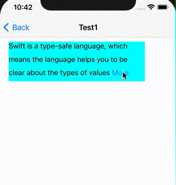
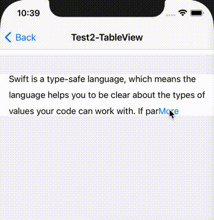

# MOAttributedTextView

# 1、Effect display

Test1：直接使用效果如下：



----

Test2：在TableViewCell里使用效果如下：



----

# 2、How to use

add the `MOAttributedTextView.swift` file to your project

## 1)、Direct Use

```swift
// 1. just need to set frame.width
var moTextView: MOAttributedTextView = MOAttributedTextView(frame: CGRect(x: 0, y: 0, width: UIScreen.main.bounds.width - 30, height: 0))

// 2. Set some parameters as required
let font: UIFont = .systemFont(ofSize: 16)
let allText =
    """
    Swift is a type-safe language, which means the language helps you to be clear about\
     the types of values your code can work with. If part of your code requires a String,\
    type safety prevents you from passing it an Int by mistake. Likewise, type safety\
    prevents you from accidentally passing an optional String
    """
let attributs: [NSAttributedString.Key : Any] = [
  .foregroundColor: UIColor.black,
  .font: font
]
let pargraphStyle = NSMutableParagraphStyle()
pargraphStyle.lineSpacing = 10

// example
moTextView.moDelegate = self // follow the MOAttributedTextViewDelegate protocl
moTextView.moLessLine = 3 // defaut：3
moTextView.moAllText = allText
moTextView.moOpenText = "More" // defaut：More
moTextView.moCloseText = "Close" // defaut：Close (if not, set "")
moTextView.moAttributs = attributs // font defaut：.systemFont(ofSize: 16)
moTextView.moParagraph = pargraphStyle // defaut：NSMutableParagraphStyle()
moTextView.backgroundColor = .cyan
moTextView.moReloadTextView()
view.addSubview(moTextView) // add to superView

// 3. Implementation protocol method, get height to refresh frame
// MARK: - MOAttributedTextViewDelegate
func moTextViewHeightChanged(_ height: CGFloat) {
    moTextView.frame = CGRect(x: 20, y: 100, width: UIScreen.main.bounds.width - 30, height: height)
}
```

----

## 2)、Use in cell

Need to  `import Snapkit`

### （1）、at Custom TableViewCell

```swift
// 1. just need to set frame.width
private var moTextView: MOAttributedTextView = MOAttributedTextView(frame: CGRect(x: 0, y: 0, width: UIScreen.main.bounds.size.width - 30, height: 0))
var allText: String = "" {
    didSet {
        moTextView.moAllText = allText
        moTextView.moReloadTextView()
    }
}

// 2. Set some parameters as required (at init func)
let font: UIFont = .systemFont(ofSize: 16)
let attributs: [NSAttributedString.Key : Any] = [
  .foregroundColor: UIColor.black,
  .font: font
]
let pargraphStyle = NSMutableParagraphStyle()
pargraphStyle.lineSpacing = 10
moTextView.moLessLine = 3 // defaut：3
moTextView.moAllText = allText
moTextView.moOpenText = "More" // defaut：More
moTextView.moCloseText = "Close" // defaut：Close (if not, set "")
moTextView.moAttributs = attributs // font defaut：.systemFont(ofSize: 16)
moTextView.moParagraph = pargraphStyle // defaut：NSMutableParagraphStyle()
moTextView.moIsOpen = false
moTextView.moDelegate = self
contentView.addSubview(moTextView)
moTextView.snp.makeConstraints { (make) in
    make.top.bottom.equalToSuperview()
    make.left.equalToSuperview().offset(16)
    make.right.equalToSuperview().offset(-16)
}

// 3.1 Agents out click event
protocol MOTableViewCellDelegate {
    func tapTextViewCell(_ isOpen: Bool)
}
// 3.2
var delegate: MOTableViewCellDelegate?
// 3.3
extension MOTableViewCell: MOAttributedTextViewDelegate {
    func moTapTextView(_ isOpen: Bool) {
        delegate?.tapTextViewCell(isOpen)
    }
}

```

### （2）、at View Controller 

```swift
// 4. calculation height
private var textViewCloseHeight: CGFloat = 0.0
private var textViewOpenHeight: CGFloat = 0.0
MOAttributedTextView.calculateHeight(text: allText, closeText: "Close", font: .systemFont(ofSize: 16), lineSpacing: 10, width: 300, lessLine: 3) { (closeHeight, openHeight) in
    textViewCloseHeight = closeHeight
    textViewOpenHeight = openHeight
}

// 5.1 dataSource
private var textIsOpen: Bool = false
private let allText =
    """
    Swift is a type-safe language, which means the language helps you to be clear about\
     the types of values your code can work with. If part of your code requires a String,\
    type safety prevents you from passing it an Int by mistake. Likewise, type safety\
    prevents you from accidentally passing an optional String
    """
// 5.2
var tableView: UITableView = {
    let tableView = UITableView(frame: CGRect(x: 0, y: 100, width: UIScreen.main.bounds.size.width, height: 400), style: .grouped)
    tableView.register(MOTableViewCell.self, forCellReuseIdentifier: "MOTableViewCell")
    return tableView
}()
// 5.3
tableView.dataSource = self
view.addSubview(tableView)
tableView.reloadData()
// 5.4
extension MOTest2ViewController: UITableViewDataSource {
    func numberOfSections(in tableView: UITableView) -> Int {
        return 1
    }
    func tableView(_ tableView: UITableView, numberOfRowsInSection section: Int) -> Int {
        return 1
    }
    func tableView(_ tableView: UITableView, cellForRowAt indexPath: IndexPath) -> UITableViewCell {
        let cell: MOTableViewCell = tableView.dequeueReusableCell(withIdentifier: "MOTableViewCell", for: indexPath) as! MOTableViewCell
        cell.allText = allText
        cell.delegate = self
        return cell
    }
    func tableView(_ tableView: UITableView, heightForRowAt indexPath: IndexPath) -> CGFloat {
        return textIsOpen ? textViewOpenHeight : textViewCloseHeight
    }
}

// 6. Achieve proxy refresh height
extension MOTest2ViewController: MOTableViewCellDelegate {
    /// receive textView tap action
    /// - Parameter isOpen: textView open or close
    func tapTextViewCell(_ isOpen: Bool) {
        textIsOpen = isOpen
        tableView.reloadData() // to reload cell height
    }
}
```


参考：

[iOS 富文本添加点击事件](https://www.jianshu.com/p/480db0cc7380)

[Ranges in Swift explained with code examples](https://www.avanderlee.com/swift/ranges-explained/)

[ios获取UILabel每行显示的文字](https://www.jianshu.com/p/65a07b6013c7)

